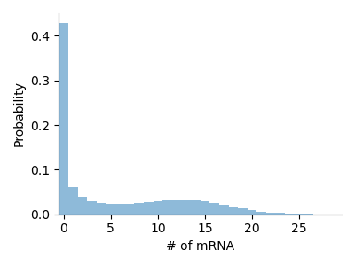

# FiniteStateProjection.jl

[](https://kaandocal.github.io/FiniteStateProjection.jl/dev/)

Finite State Projection [[1]](#1)  algorithms for chemical reaction networks based on [Catalyst.jl](https://github.com/SciML/Catalyst.jl) and [ModelingToolkit.jl](https://github.com/SciML/ModelingToolkit.jl). Converts descriptions of reaction networks into `ODEProblem`s and `SteadyStateProblem`s for use with [DifferentialEquations.jl](https://github.com/SciML/DifferentialEquations.jl).

## Features:
- Built on top of [Catalyst.jl](https://github.com/SciML/Catalyst.jl)
- FSP equations are generated as `ODEFunction`/`ODEProblem`s and can be solved with [DifferentialEquations.jl](https://github.com/SciML/DifferentialEquations.jl), with on-the-fly generation of targeted functions for improved performance
- The Chemical Master Equation can be represented as a `SparseMatrixCSC`

More information is available in the [documentation](https://kaandocal.github.io/FiniteStateProjection.jl/dev/). Please feel free to open issues and submit pull requests! 

## Examples
### Birth-Death System
```julia
using FiniteStateProjection
using OrdinaryDiffEq

rn = @reaction_network begin
    σ, 0 --> A
    d, A --> 0
end σ d

sys = FSPSystem(rn)

# Parameters for our system
ps = [ 10.0, 1.0 ]

# Initial distribution (over 1 species)
# Here we start with 0 copies of A
u0 = zeros(50)
u0[1] = 1.0 

prob = convert(ODEProblem, sys, u0, (0, 10.0), ps)
sol = solve(prob, Vern7())
```


### Telegraph Model
```julia
using FiniteStateProjection
using OrdinaryDiffEq

rn = @reaction_network begin
    σ_on * (1 - G_on), 0 --> G_on
    σ_off, G_on --> 0
    ρ, G_on --> G_on + M
    d, M --> 0
end σ_on σ_off ρ d

sys = FSPSystem(rn)

# Parameters for our system
ps = [ 0.25, 0.15, 15.0, 1.0 ]

# Initial distribution (over two species)
# Here we start with 0 copies of G_on and M
u0 = zeros(2, 50)
u0[1,1] = 1.0

prob = convert(ODEProblem, sys, u0, (0, 10.0), ps)
sol = solve(prob, Vern7())
```


## TODO:
- Add bursty reactions
- Add support for sparse Jacobians

## References

<a id="1">[1]</a> B. Munsky and M. Khammash, "The Finite State Projection algorithm for the solution of the Chemical Master Equation", Journal of Chemical Physics 124, 044104 (2006). https://doi.org/10.1063/1.2145882
