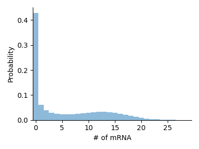

# Examples

## Birth-Death Model

This example models a linear birth-death process. The reaction network is easily defined using [Catalyst.jl](https://github.com/SciML/Catalyst.jl). Our truncated state space has length 50, which is enough for this simple system.

This system has no conserved quantities, so we use a [`NaiveIndexHandler`](@ref) to map from a one-dimensional array with offset 1 to the state of the system. See [Index Handlers](@ref) for more details.

```julia
using FiniteStateProjection, DifferentialEquations

@parameters r1, r2
rs = @reaction_network begin
    r1, 0 --> A
    r2, A --> 0
end r1 r2

sys = FSPSystem(rs)

# Parameters for our system
ps = [ 10.0, 1.0 ]

# Initial values
u0 = zeros(50)
u0[1] = 1.0

prob = convert(ODEProblem, NaiveIndexHandler(sys, 1), sys, u0, 10.0, ps)
sol = solve(prob, Vern7(), atol=1e-6)
```


## Telegraph Model

Here we showcase the telegraph model, a simplistic description of mRNA transcription in biological cells. We have one gene that transitions stochastically between an *on* and an *off* state and produces mRNA molecules while it is in the *on* state.

This system technically consists of three different species, namely the two states of the gene and mRNA. It is clear, however, that these are not independent as ``D_{on}(t) + D_{off}(t) = 1``. In order to solve the Chemical Master Equation we can therefore recover ``D_{off}(t)`` from the other variables and the entire state of the system is described by only two variables: ``D_{on}(t)`` and ``M(t)``, as well as the total number of genes, which is a constant equal to $1$. The default index handler class [`DefaultIndexHandler`](@ref) does this for us automatically and maps the state of the system to a two-dimensional array. This showcases that we can often reduce the number of species in the system to make it easier to solve numerically.

```julia
using FiniteStateProjection, DifferentialEquations

@parameters r1 r2 r3 r4
rs = @reaction_network begin
    r1, G_on --> G_on + M
    (r2, r3), G_on <--> G_off
    r4, M --> 0
end r1 r2 r3 r4

sys = FSPSystem(rs)

# There is one conserved quantity: G_on + G_off
cons = conservedquantities([1,0,0], sys)

# Parameters for our system
ps = [ 15.0, 0.25, 0.15, 1.0 ]

# Since G_on + G_off = const. we do not have to model the latter separately
u0 = zeros(2, 50)
u0[1,1] = 1.0

prob = convert(ODEProblem, DefaultIndexHandler(sys, 1), sys, u0, 10.0, (ps, cons))
sol = solve(prob, Vern7(), atol=1e-6)
```

